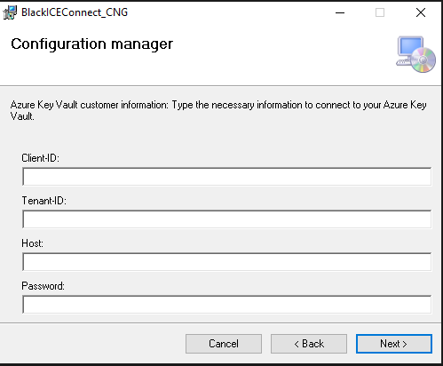

# Install BlackICE Connect CNG KSP for Windows 

Once 'BlackICEConnect.sln' is built an installer is created in the 'CNG_Installer' folder. Follow these steps for installation

1. Run 'setup.exe' placed in 'CNG_Installer' folder (Release or Debug).
    - 

2. Choose the installation folder and click Next.
    - 

3. Enter the Azure Key Vault credentials and click Next.
    - 

4. Enter the log options and click Next.
    - 

5. Insert the user password (PIN) and click Next.
    - 

6. Click Close to complete Setup
    - 