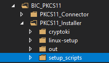
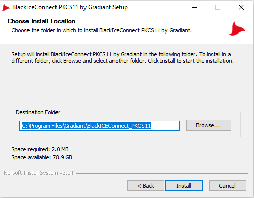
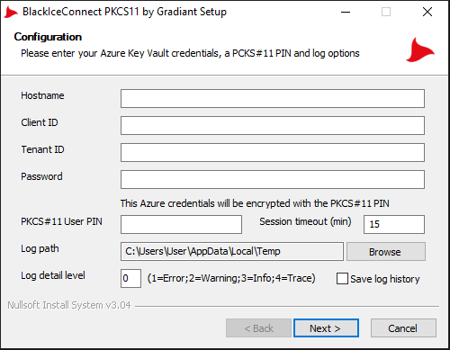
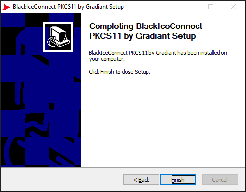

# Install BlackICE Connect PKCS#11 for Windows 

Once 'BlackICEConnect.sln' is built an installer is created in the `BIC_PKCS11\PKCS11_Installer\setup_scripts` folder. Follow these steps for installation

1. Run 'Gradiant_BlackIceConnect_x64_Setup.exe' placed in 'setup_scripts' folder.
    - 

2. Choose the folder to install BlackICE Connect and click Install.
    - 

3. Enter the Azure Key Vault credentials, the PKCS#11 PIN and the log options.
    - 
    
4. Click Finish to close Setup
    - 