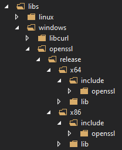
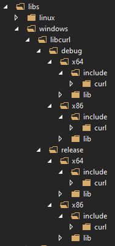

# BlackICE Connect (BIC)
BIC is a crypto provider that allows applications using standardized cryptographic interfaces to transparently use cryptographic keys provided by Microsoft’s [Azure Key Vault](https://azure.microsoft.com/en-us/services/key-vault/) service.
[Azure Key Vault](https://azure.microsoft.com/en-us/services/key-vault/) provides Cloud-hosted Hardware Security Module (HSM) services that allow you store the keys and perform cryptographic operations in a cluster of FIPS 140-2 certified HSMs. This way there is no need to provision, configure, patch, and maintain HSMs and key management software which leads to a significant reduction in costs. 
However, many applications need to be modified to use Azure Key Vault because it does not support the most common standard cryptographic providers. By means of BIC it is possible integrate your apllications to Azure Key Vault  without adding a line of code. 

## Supported standard cryptographic providers
BIC implements two standard crypto providers to [Azure Key Vault](https://azure.microsoft.com/en-us/services/key-vault/): 
- The [CNG Key Storage Provider (KSP)](https://docs.microsoft.com/en-us/windows/win32/seccng/cng-portal) and
- The [PKCS#11 Provider](https://www.oasis-open.org/committees/tc_home.php?wg_abbrev=pkcs11) 

## Supported operating systems
- Windows Server 2008, 2012, 2016 for 64 bits (both, CNG KSP and PKCS#11 providers)
- Windows Desktop Vista, 8, 8.1, 10 for 32 and 64 bits (both, CNG KSP and PKCS#11 providers)
- Linux Ubuntu Server for 32 and 64 bits (only PKCS#11 provider)
- Linux Ubuntu Desktop for 32 and 64 bits (only PKCS#11 provider)

BIC provider may work in other Linux distributions but it hasn't been tested

## Supported applications
Please, see the [BIC_Supported_Applications.md](BIC_Supported_Applications.md) file.

## Supported cryptographic functions
Please, see the [BIC_Supported_CryptoFunctions.md](BIC_Supported_CryptoFunctions.md) file.

## Building BIC for Windows OS (both providers, CNG KSP and PKCS#11)
BlackICE Connect for windows has been created as a [Visual Studio solution](BlackICEConnect.sln)

### Requirements to build BIC for Windows:
- Microsoft Visual Studio 2017 o newer
- Microsoft Windows SDK
- [Microsoft Visual Studio Installer Projects](https://marketplace.visualstudio.com/items?itemName=VisualStudioClient.MicrosoftVisualStudio2017InstallerProjects). It can be installed from the link or from Visual Studio `Manage extensions`. (Only for building CNG KSP provider installing)
- [Microsoft Cryptographic Provider Development Kit](https://www.microsoft.com/en-us/download/details.aspx?id=30688) (only for CNG KSP provider)
- [OpenSSL 1.0.2l](https://github.com/openssl/openssl/archive/OpenSSL_1_0_2l.zip)
- [libCurl 7.55.1](https://github.com/curl/curl/releases/download/curl-7_55_1/curl-7.55.1.zip)
- [base64URL](https://github.com/jons/base64url) (already shipped in this repository)
- [cJSON](https://github.com/DaveGamble/cJSON) (already shipped in this repository)
- [Nullsoft scriptable install system](https://nsis.sourceforge.io/Download) installed to the default location. (only for building PCKS#11 provider installer)

### Instructions to build BIC for Windows:
1. Copy folders `Include` and `Lib` from Microsoft Cryptographic Provider Development Kit installation folder (by default it is installed in C:\Program Files (x86)\Windows Kits\8.0\Cryptographic Provider Development Kit) to the following paths:
    - $(SolutionDir)\BIC_CNG\CNG_Connector
    - $(SolutionDir)\BIC_CNG\CNG_Register
2. Compile OpenSSL statically for the following targets and place in the following directories:
    - Release/x86: placed in $(SolutionDir)\libs\windows\openssl\release\x86
    - Release/x64: placed in $(SolutionDir)\libs\windows\openssl\release\x64
    - 
3. Compile libCurl statically for the following targets and place in the following directories:
    - Debug/x86: placed in $(SolutionDir)\libs\windows\libcurl\debug\x86
    - Debug/x64: placed in $(SolutionDir)\libs\windows\libcurl\debug\x64
    - Release/x86: placed in $(SolutionDir)\libs\windows\libcurl\release\x86
    - Release/x64: placed in $(SolutionDir)\libs\windows\libcurl\release\x64
    - 
4. Open `BlackICEConnect.sln` file with Visual Studio
5. Select the target to build between Debug/Release and x86/x64.
6. Select Build->Buid solution. To build the tests for the PKCS#11 provider it is necessary to create the file `Test_Projects\akv_pkcs11.Test\BlackICEconnect.cnf` from the template `Test_Projects\akv_pkcs11.Test\BlackICEconnect_win.cnf` and fill in all the required fields. This file is used by the tests in order to access the AKV vault.

### Installing BIC - CNG KSP
In order to install BIC CNG KSP provider it is necessary an active Azure account and a created Azure Key Vault.
Please, see the [Install_BIC_KSP_Windows.md](Install_BIC_KSP_Windows.md) file for Windows BIC - CNG KSP intallation details 

### Installing BIC - PKCS#11
In order to install BIC PKCS#11 provider it is necessary to have an Azure Key Vault account and to have a created vault.
Please, see the [Install_BIC_PKCS11_Windows.md](Install_BIC_PKCS11_Windows.md) file for Windows BIC - PKCS#11 intallation details

## Building BIC for Linux OS (only PKCS#11)
BlackICE Connect for Linux is built using CMake scripts.

### Requirements to build BIC for Linux:
- GNU Make
- GNU C++ Compiler or compatible
- pkg-config
- CMake 3.9
- [OpenSSL 1.0.2n](https://github.com/openssl/openssl/archive/OpenSSL_1_0_2n.zip)
- [libCurl 7.54.0](https://github.com/curl/curl/releases/download/curl-7_54_0/curl-7.54.0.zip)
- [zlib 1.2.11](https://github.com/madler/zlib/archive/v1.2.11.zip)
- [base64URL](https://github.com/jons/base64url) (already shipped in this repository)
- [cJSON](https://github.com/DaveGamble/cJSON) (already shipped in this repository)
- Mono (for building the tests)
- NUnit framework (for running the tests)

Please, refer to [Building_Linux_dependencies](Building_Linux_dependencies.md).

### Instructions to build BIC for Linux:
BlackICE Connect for Linux can be built by running the 'linux-compile.sh' script from the directory BIC_PKCS11/PKCS11_Connector.
The following command args can be passed to the script:
* -x86 (-m32): forces 32bit compilation.
* -t (--trace): changes CMake to trace mode ([cmake3.9 help](https://cmake.org/cmake/help/v3.9/manual/cmake.1.html))
* -d: (default) compiles in debug mode (GCC debug options). Links to debug version of libraries dependencies (except zlib that only has release versions) and allows to debug with gdb without optimizations (-O0) and with maximum level of information(-g3).
* -r: release mode of the library. Links to the release versions of the libraries dependencies.
* -c (--clean): cleans all the CMake generated files before compiling.

This script creates a directory `linux-build` if it doesn't exist from where an out-of-source build is generated, in order to keep the project clean.
The installer for BlackICE Connect for Linux can be built by running the 'linux-compile.sh' script from the directory BIC_PKCS11/PKCS11_Installer. It supports the same arguments as the compile script for the provider. It will create the directory BIC_PKCS11/PKCS11_Installer/linux-installer/{debug/release}/{x86/x64} containing the provider library and other necessary files for the installation.

### Installing BIC - PKCS#11
In order to install BIC PKCS#11 provider it is necessary an active Azure account and a created Azure Key Vault.
Please, see the [Install_BIC_PKCS11_Linux.md](Install_BIC_PKCS11_Linux.md) file for Linux BIC - PKCS#11 intallation details

## Testing
Refer to the following documents for the testing procedure of the providers.
- [Test_BIC_PKCS11_Windows.md](Test_BIC_PKCS11_Windows.md)
- [Test_BIC_KSP_Windows.md](Test_BIC_KSP_Windows.md)
- [Test_BIC_PKCS11_Linux.md](Test_BIC_PKCS11_Linux.md)

Note: to test the providers it is necessary to provide the credentials to an Azure Key Vault account.

## Authors
Please, refer to [AUTHORS](AUTHORS)

## Contributors
Please, refer to [CONTRIBUTORS](CONTRIBUTORS)

## License
BIC is licensed under the Mozilla Public License v2.0 - see the [LICENSE](LICENSE) file for details